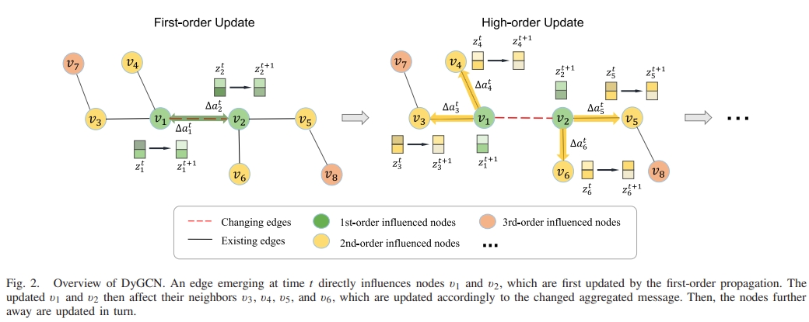

# DyGCN



This is the code for the TOIS Paper: [DyGCN: Dynamic Graph Embedding with Graph Convolutional Network](https://ieeexplore.ieee.org/document/9925994).

## Usage


## Requirements


## Citation

Please cite our paper if you use the code:

```
@ARTICLE{9925994,
  author={Cui, Zeyu and Li, Zekun and Wu, Shu and Zhang, Xiaoyu and Liu, Qiang and Wang, Liang and Ai, Mengmeng},
  journal={IEEE Transactions on Neural Networks and Learning Systems}, 
  title={DyGCN: Efficient Dynamic Graph Embedding With Graph Convolutional Network}, 
  year={2024},
  volume={35},
  number={4},
  pages={4635-4646},
  keywords={Convolution;Deep learning;Task analysis;Transforms;Social networking (online);Principal component analysis;Optimization;Dynamic graphs;graph convolutional network (GCN);neural network},
  doi={10.1109/TNNLS.2022.3185527}}
```
